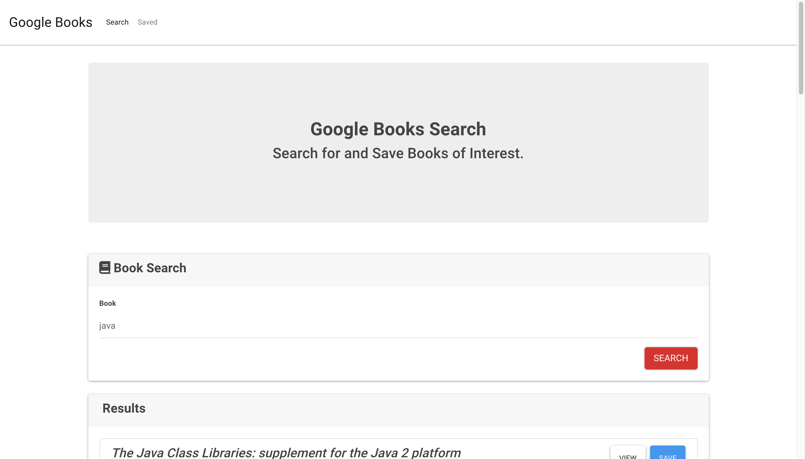
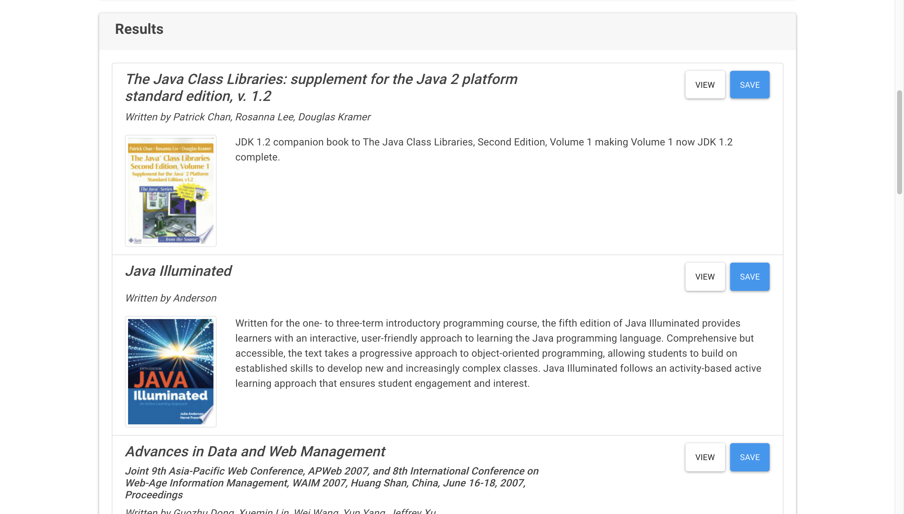
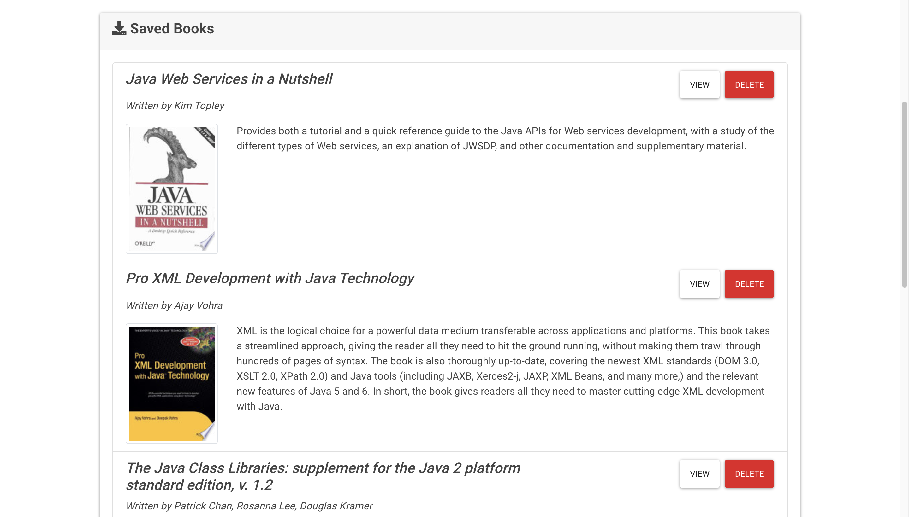

# Google Books Search

## Description
In this activity, I create a new React-based Google Books Search app. It's required to create React components, work with helper/util functions, and utilize React lifecycle methods to query and display books based on user searches.  Also use Node, Express and MongoDB so that users can save books to review or purchase later.

## Project links
<li>GitHub link: https://github.com/huqian301/Google-Books-Search </li>
<li>Heroku link: https://books-search-go.herokuapp.com/</li>

## Output 
Here is the [Video](https://drive.google.com/file/d/1K-Og6mIF41m1MZMQxsT1qTrKw6KGGF6-/view?usp=sharing) that shows entire page. 

The final page will be look like as below image.

 

